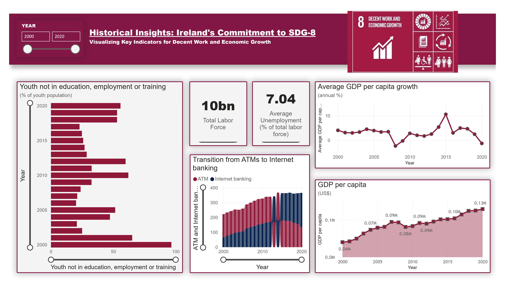
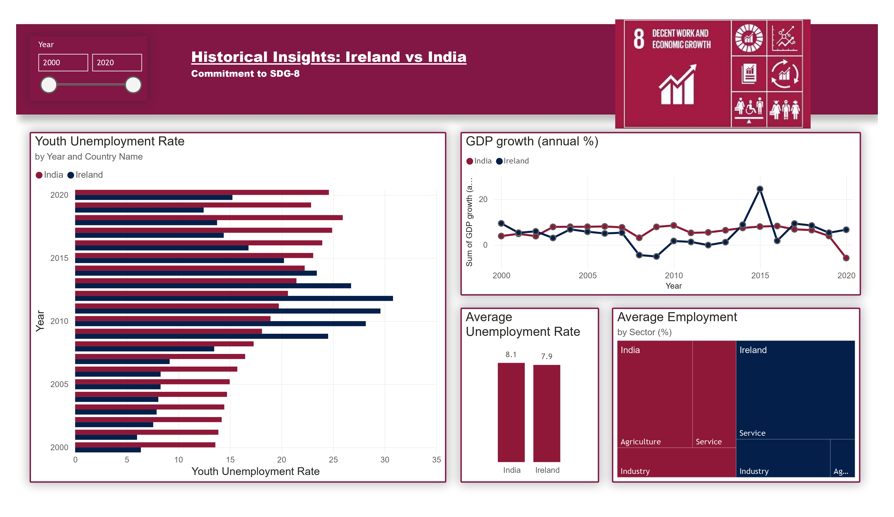
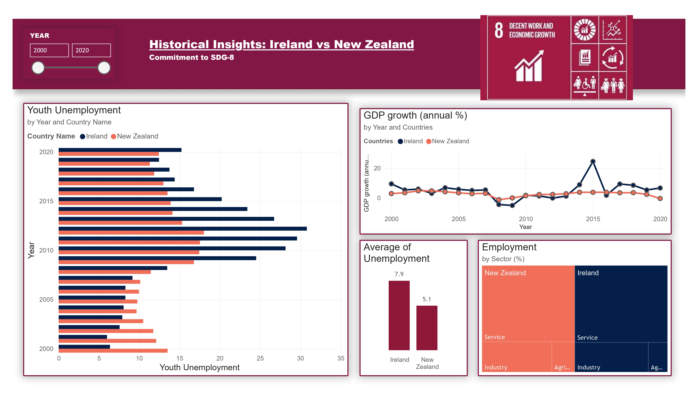
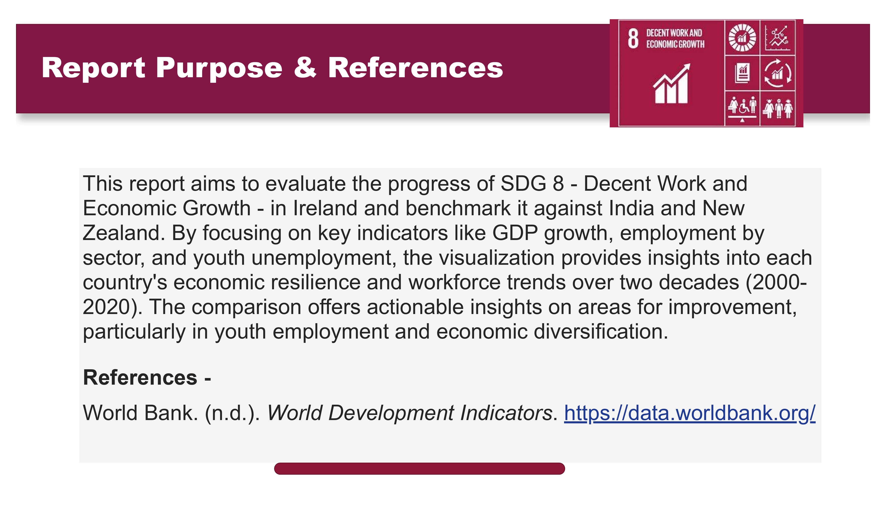

# SDG 8 Dashboard (Power BI Dashboard)

Power BI dashboard to evaluate SDG 8 (Decent Work & Economic Growth) for **Ireland** and benchmark against **India** and **New Zealand** using World Bank World Development Indicators (WDI) data.

## What’s included
- WDI country extracts (CSV):
  - `API_IRL_DS2_en_csv_v2_1810.csv` (Ireland) [file:2]
  - `API_IND_DS2_en_csv_v2_134.csv` (India) [file:1]
  - `API_NZL_DS2_en_csv_v2_20206.csv` (New Zealand) [file:3]
- Power BI dashboard (PBIX).

## Data source
World Bank — *World Development Indicators (WDI)*: https://data.worldbank.org/ [web:54]

## Snapshots of Dashboard.
## Dashboard Overview

